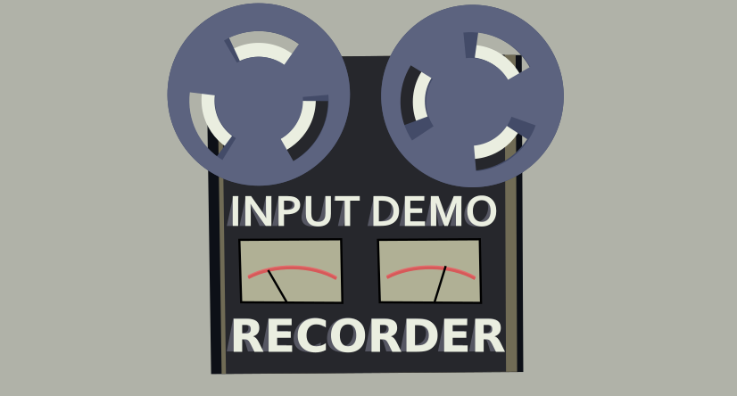

# 

Made to allow a simmilar feature that exist in source games and on Trackmania, this mod is capable of reading and change the inputs that the game will read on the fly.
With this tool you can:
* Record your inputs
* Play the recorded inputs
* Save and load the recorded inputs into files (.owdemo)
* Load *TAS* files (WIP)
* Start recording as soon as a new scene is loaded
* Start playingback as soon as a new scene is loaded
